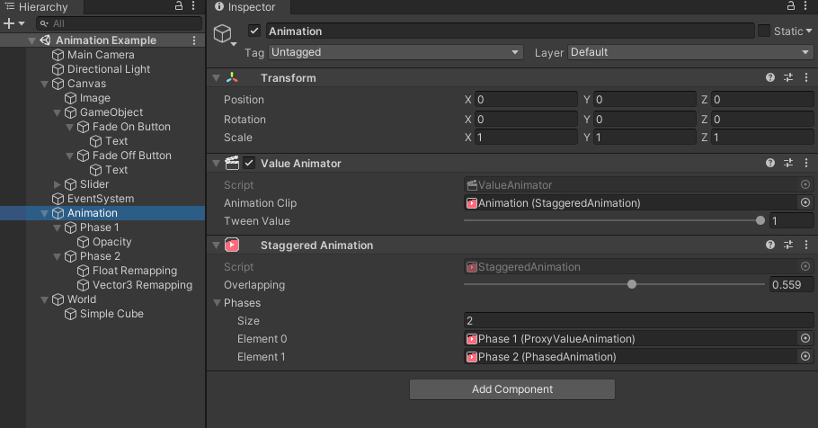
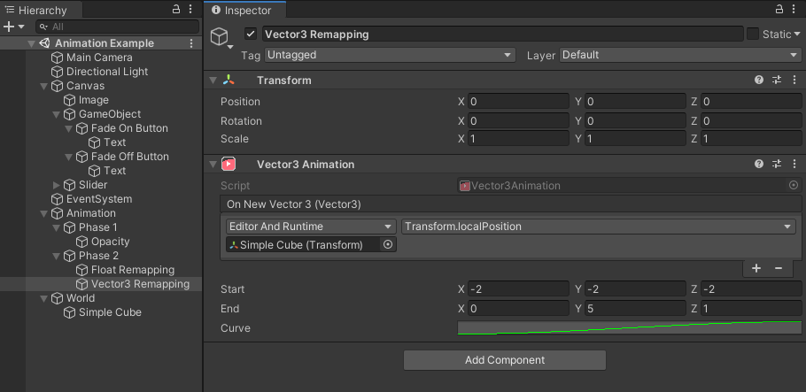

# About Value Remapper

Use the Value Remapper package to create and author procedural animations. For example, use Value Remapper to create animations that can be interrupted at any time and ensure a consistent state of any tweenable value. 

# Installing Value Remapper

To install this package, follow the instructions in the [Package Manager documentation](https://docs.unity3d.com/Packages/com.unity.package-manager-ui@latest/index.html). 

# Using Value Remapper

Value Remapper is a loose set of tools that remap ``[0...1]`` values to a new value range, to use it, start with creating
a ``Value Animator`` at any gameobject in your scene. It needs a top-level animation, which is usually the first remapper.
For example use a ``Staggered Animation`` to create an overlapping set of animations (for example you want to let multiple
UI components open in the same fashion, but slightly after another).

Finally you need value mappers, for example a Vector3 Animation, which interpolations from start to end between ``[0...1]``.
This is optimal to move an object between two spots. With the attached event emitter you can directly write into the
``localPosition`` of a ``Transform``. Ensure that the emitter is set to "Runtime and Editor" to be able to test the
animation by dragging the ``Value Animator``s Tween Value.  
The animation curve allows for controlling how the interpolation transitions, giving more options than simply linearly
interpolating.

This setup can be found in the provided example scene, showing various use cases.

# Technical details
## Requirements

This version of Value Remapper is compatible with the following versions of the Unity Editor:

* 2019.4 and later (recommended)

## Document revision history

| Date         | Reason                                         |
|--------------|------------------------------------------------|
| Aug 08, 2020 | Document created. Matches package version 1.0. |
